<!-- _class: lead -->
<!-- _paginate: skip -->
<!-- _color: WHITE -->
<!-- _backgroundColor: #232f3e -->
# <!-- fit -->LINEとSlackとBedrock

2023/11/13 JAWS-UG東京 2023 ～Bedrock Night～
### 森田 和明

---
# お招きありがとうございます。


JAWS-UG東京とのことですが、__鹿__ と __大仏__ の国から参加させて頂いています。

→Bedrockで生成
「Illustration of the country of deer and the Great Buddha」

---
# 自己紹介

富士ソフト株式会社
エリア事業本部 西日本支社 インテグレーション＆ソリューション部

## 森田　和明

* 2023 Japan AWS Ambassadors

生息地
* 個人ブログ: https://moritalous.pages.dev/
* Qiita: https://qiita.com/moritalous
* X: https://x.com/moritalous

---
# アジェンダ

1. LINEとBedrock（Anthropic Claude）でチャット
2. SlackとBedrock(Stable Diffusion XL)で画像生成

---
<!-- _class: lead -->
<!-- _paginate: skip -->
<!-- _color: WHITE -->
<!-- _backgroundColor: #232f3e -->

# <!-- fit -->1. LINEとBedrock（Anthropic Claude）でチャット

---
# Lambdaで開発する前に...

まずはローカル環境でやってみましょう。

boto3とLangChainをインストールします。

```shell
pip install boto3 langchain==0.0.325 openai
```

※LangChainのバージョンは一応固定してみました。
※openaiは話の流れ上必要なだけです。

---
# LangChainでチャット（OpenAI版）

https://python.langchain.com/docs/modules/memory/adding_memory を参考にしました

```python
from langchain.chains import ConversationChain
from langchain.chat_models import ChatOpenAI
from langchain.memory import ConversationBufferMemory

llm = ChatOpenAI()

memory = ConversationBufferMemory()

chain = ConversationChain(
    llm=llm, 
    memory=memory, 
    verbose=True
)
```

---
```python
chain.predict(input="こんにちは。")
```

```
> Entering new ConversationChain chain...
Prompt after formatting:
The following is a friendly conversation between a human and an AI. The AI is talkative and provides lots of specific details from its context. If the AI does not know the answer to a question, it truthfully says it does not know.

Current conversation:

Human: こんにちは。
AI:

> Finished chain.
```

```python
'こんにちは！元気ですか？どのようにお手伝いできますか？'
```

---

```python
chain.predict(input="今日は晴れです。どのようなタスクができますか？")
```
```
> Entering new ConversationChain chain...
Prompt after formatting:
The following is a friendly conversation between a human and an AI. The AI is talkative and provides lots of specific details from its context. If the AI does not know the answer to a question, it truthfully says it does not know.

Current conversation:
Human: こんにちは。
AI: こんにちは！元気ですか？どのようにお手伝いできますか？
Human: 今日は晴れです。どのようなタスクができますか？
AI:

> Finished chain.
```

```python
'私はさまざまなタスクをこなすことができます。例えば、日常生活のアドバイスや情報の提供、予定の管理、翻訳、ニュースの読み上げ、天気予報の提供などができます。どのようなタスクが必要ですか？'
```

チャット履歴も覚えてくれてますね

---
<!-- _class: lead -->
# <!--fit-->Bedrockする

I'm just a Japanese BEDROCKER!

---
# LangChainでチャット（**Bedrock版**）

```diff
  from langchain.chains import ConversationChain
- from langchain.chat_models import ChatOpenAI
+ from langchain.chat_models import BedrockChat
  from langchain.memory import ConversationBufferMemory

- llm = ChatOpenAI()
+ llm = BedrockChat(model_id="anthropic.claude-instant-v1")

  memory = ConversationBufferMemory()

  chain = ConversationChain(
      llm=llm, 
      memory=memory, 
      verbose=True
  )
```

これだけ！！東京リージョンで使えるClaude Instantでも、全然行けます！！

---
```python
chain.predict(input="こんにちは。")
```

```
> Entering new ConversationChain chain...
Prompt after formatting:
The following is a friendly conversation between a human and an AI. The AI is talkative and provides lots of specific details from its context. If the AI does not know the answer to a question, it truthfully says it does not know.

Current conversation:

Human: こんにちは。
AI:
/home/ubuntu/workspace/2310-line-slack-bedrock/.venv/lib/python3.10/site-packages/langchain/llms/bedrock.py:50: UserWarning: Error: Prompt must alternate between '

Human:' and '

Assistant:'. Received 
```

---
```
Human: The following is a friendly conversation between a human and an AI. The AI is talkative and provides lots of specific details from its context. If the AI does not know the answer to a question, it truthfully says it does not know.

Current conversation:

Human: こんにちは。
AI:

Assistant:
  warnings.warn(ALTERNATION_ERROR + f" Received {input_text}")

> Finished chain.
```

```python
' こんにちは。はじめまして。私は人工知能のアシスタントです。質問があればしっかり答えられるようにベストを尽くしますが、知識の範囲は限られています。よろしくお願いします。'
```

回答は返ってきましたが、Warningが出てます。。

---
エラーの意訳

# <!--fit-->「`Human:`と`Assistant:`で囲まんかい！」

無視しても良さそうだけど、気になる

---
# Bedrock村で修行します

はしもとさんのスーパースライドを確認します。
https://www.docswell.com/s/s3kzk/58G697-20231027-bedrock-lt

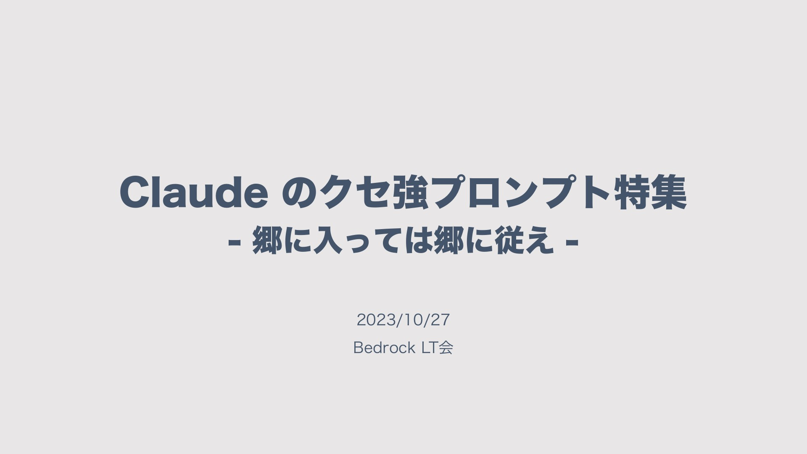 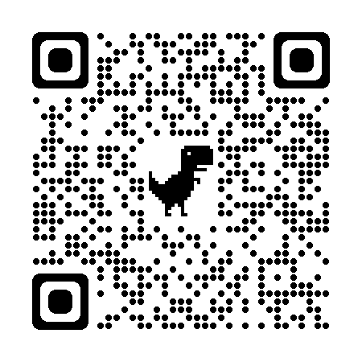

---
# 入村!!


---
# 村のしきたり
* その１：
**合言葉は、`\n\nHuman: \n\nAssistant:`** [P.29](https://www.docswell.com/s/s3kzk/58G697-20231027-bedrock-lt#p29)
* その２：
重要な情報は **`XMLタグで囲う`** [P.36](https://www.docswell.com/s/s3kzk/58G697-20231027-bedrock-lt#p36)
* その３：
会話の履歴を使うとき区切り文字に **`"Human:"`、`"Assistant:"`を使わない** [P.42](https://www.docswell.com/s/s3kzk/58G697-20231027-bedrock-lt#p42)

---
<!-- _class: lead -->
# <!--fit-->ありがとう！村長！！

---
# ところで今のプロンプトは？

```python
chain.prompt
```

```
PromptTemplate(
  input_variables=['history', 'input'], 
  template='The following is a friendly conversation between a human and an AI. The AI is talkative and provides lots of specific details from its context. If the AI does not know the answer to a question, it truthfully says it does not know.\n\nCurrent conversation:\n{history}\nHuman: {input}\nAI:')
```

なるほど。

---
# しきたりに従う

* その１：
**合言葉は、`\n\nHuman: \n\nAssistant:`** [P.29](https://www.docswell.com/s/s3kzk/58G697-20231027-bedrock-lt#p29)
→ これはLangChainが勝手にやってくれます

* その２：
重要な情報は**XMLタグで囲う** [P.36](https://www.docswell.com/s/s3kzk/58G697-20231027-bedrock-lt#p36)
→ **{hisotry}の前後を`<history>`と`</history>`で囲う**

* その３：
会話の履歴を使うとき区切り文字に **"Human:"、"Assistant:"を使わない** [P.42](https://www.docswell.com/s/s3kzk/58G697-20231027-bedrock-lt#p42)
→ **PromptTemplateの中に埋め込まれている`Human:`と`AI`を`H:`と`A:`にする**

---
```python
from langchain.chains import ConversationChain
from langchain.chat_models import BedrockChat
from langchain.memory import ConversationBufferMemory
from langchain.prompts import PromptTemplate

prompt_template = PromptTemplate(
    input_variables=['history', 'input'], 
    template='''The following is a friendly conversation between a human and an AI. The AI is talkative and provides lots of specific details from its context. If the AI does not know the answer to a question, it truthfully says it does not know.
    
Current conversation:
<history>
{history}
</history>
{input}'''  
)
```
---
```python
memory = ConversationBufferMemory(
  human_prefix="H",
  ai_prefix="A")

llm = BedrockChat(model_id="anthropic.claude-instant-v1")

chain = ConversationChain(
    llm=llm, 
    memory=memory, 
    prompt=prompt_template,
    verbose=True,
)
```

---
```python
chain.predict(input="こんにちは。")
```
```
> Entering new ConversationChain chain...
Prompt after formatting:
The following is a friendly conversation between a human and an AI. The AI is talkative and provides lots of specific details from its context. If the AI does not know the answer to a question, it truthfully says it does not know.
    
Current conversation:
<history>

</history>
こんにちは。

> Finished chain.
```

```python
' はい、こんにちは。私はAIアシスタントです。名前は何ですか。'
```

---
```python
chain.predict(input="今日は晴れです。どのようなタスクができますか？")
```
```
> Entering new ConversationChain chain...
Prompt after formatting:
The following is a friendly conversation between a human and an AI. The AI is talkative and provides lots of specific details from its context. If the AI does not know the answer to a question, it truthfully says it does not know.
    
Current conversation:
<history>
H: こんにちは。
A:  はい、こんにちは。私はAIアシスタントです。名前は何ですか。
</history>
今日は晴れです。どのようなタスクができますか？

> Finished chain.
```
```python
' はい、今日は晴れそうですね。私は Claude という名前の Chatbot です。\n\n私には特定のタスクを実行する能力はありませんが、ユーザーと会話を行うことができます。質問に答えたり、興味のあるトピックについて話したりすることができます。どのような話題が興味深いか教えてください。私にとって最善の「タスク」は、ユーザーと可能な限り有益な対話を行うことだと思います。'
```

---
# ワーニングは無事解消！！

# <!--fit-->ありがとう！村長！！

「\#村長ありがとう」「\#今日から私も村民です」をつけてお礼を投稿しよう！

---
# チャット履歴の永続化

ConversationBufferMemory（とChatMessageHistory）ではチャット履歴をメモリに保持している。データベースに永続化したい

---
# DynamoDBに永続化

LangChainがDynamoDBに対応。DynamoDBに永続化ができます。

## DynamoDBにテーブルを作成

* テーブル名は任意（`SessionTable`とします）
* パーティションキーを文字列型の`SessionId`とします。（LangChainのデフォルト値）
* ほかは何でもよし（オンデマンドモードでもOKです）

---
```diff
  from langchain.chains import ConversationChain
  from langchain.chat_models import BedrockChat
  from langchain.memory import ConversationBufferMemory
+ from langchain.memory.chat_message_histories import DynamoDBChatMessageHistory
  from langchain.prompts import PromptTemplate
  
  <<省略>>
  
+ history = DynamoDBChatMessageHistory(table_name="SessionTable", session_id="0")
  
  memory = ConversationBufferMemory(
    human_prefix="H",
    ai_prefix="A",
+   chat_memory=history
    )
  
  <<省略>>
```

履歴はsession_idごとに保存されます。

---
## もうひと手間：直近10件の履歴だけを使うようにする

```diff
  from langchain.chains import ConversationChain
  from langchain.chat_models import BedrockChat
-  from langchain.memory import ConversationBufferMemory
+  from langchain.memory import ConversationBufferWindowMemory
  from langchain.memory.chat_message_histories import DynamoDBChatMessageHistory
  from langchain.prompts import PromptTemplate
  
  <<省略>>
  
- memory = ConversationBufferMemory(
+  memory = ConversationBufferWindowMemory(
    human_prefix="H",
    ai_prefix="A",
    chat_memory=history,
+   k=10
    )
  
  <<省略>>
```

---
# `bedrock.py`にまとめる

```python
from langchain.chains import ConversationChain
from langchain.chat_models import BedrockChat
from langchain.memory import ConversationBufferWindowMemory
from langchain.memory.chat_message_histories import DynamoDBChatMessageHistory
from langchain.prompts import PromptTemplate

prompt_template = PromptTemplate(
    input_variables=['history', 'input'], 
    template='''The following is a friendly conversation between a human and an AI. The AI is talkative and provides lots of specific details from its context. If the AI does not know the answer to a question, it truthfully says it does not know.
    
Current conversation:
<history>
{history}
</history>
{input}'''  
)
```

---
```python
llm = BedrockChat(model_id="anthropic.claude-instant-v1")

def conversation(input: str, session_id: str):

  history = DynamoDBChatMessageHistory(table_name="SessionTable", session_id=str)

  memory = ConversationBufferWindowMemory(
      human_prefix="H",
      ai_prefix="A",
      chat_memory=history,
      k=10)

  chain = ConversationChain(
      llm=llm, 
      memory=memory, 
      verbose=True
  )

  return chain.predict(input=input)
```

---
# AWSのアーキテクチャ

* Amazon Bedrock
* Amazon DynamoDB
* AWS Lambda

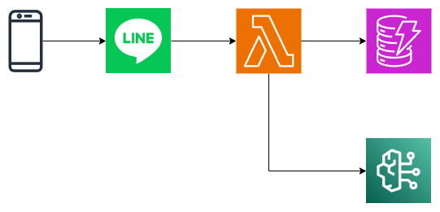

AWS Lambdaの関数URLを使うと便利。SAMも良いよ。

<!-- 
* SAM 

```shell
sam init --name line-bedrock-bot \
 --runtime python3.10 --package-type Zip \
 --app-template hello-world --no-tracing --no-application-insights
```
-->

---
<!-- _class: lead -->
# <!--fit-->さて、そろそろLINE

---
# LINE Messaging APIの設定

1. LINE Messaging APIのサイトでコンソールにログインをクリックします。
1. ログイン後の画面でプロバイダーを選択し、新規チャネル作成をクリックします。
1. Messaging APIを選択します。
1. チャネル名などを入力してチャネルを作成します。
1. 作成後のチャネルの画面の下部にあるチャネルシークレットをメモします。
1. Messaging API設定タブに移動し、画面下部にあるチャネルアクセストークン（長期） の発行ボタンをクリックします。表示されるアクセストークンをメモします。

チャネルシークレットとアクセストークンが必要になります。

---
1. LINE Messaging APIのサイトでコンソールにログインをクリックします。
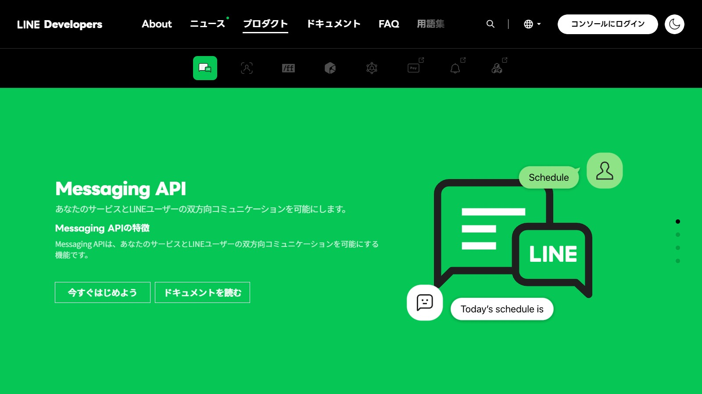

---
2. ログイン後の画面でプロバイダーを選択し、新規チャネル作成をクリックします。
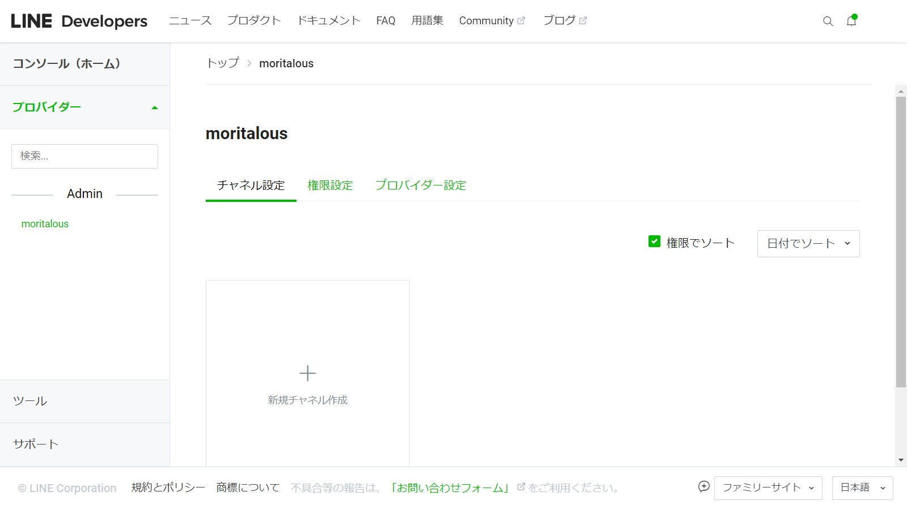

---
3. Messaging APIを選択します。
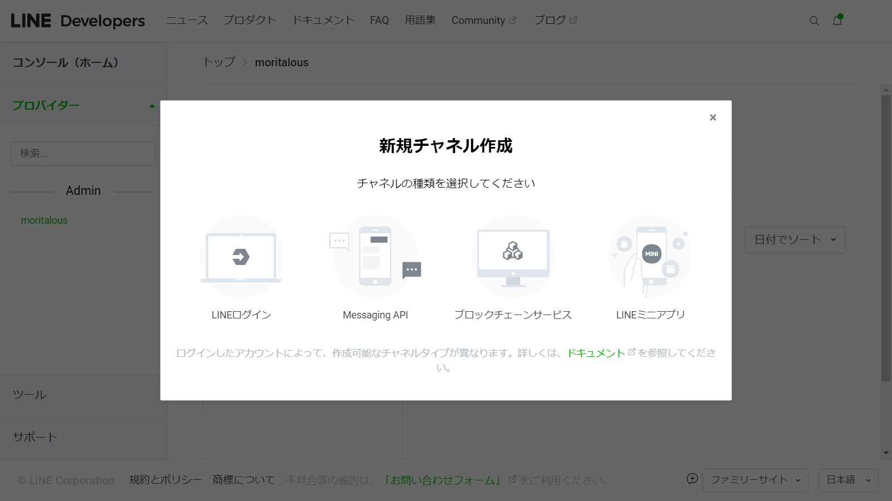

---
4. チャネル名などを入力してチャネルを作成します。
5. 作成後のチャネルの画面の下部にあるチャネルシークレットをメモします。
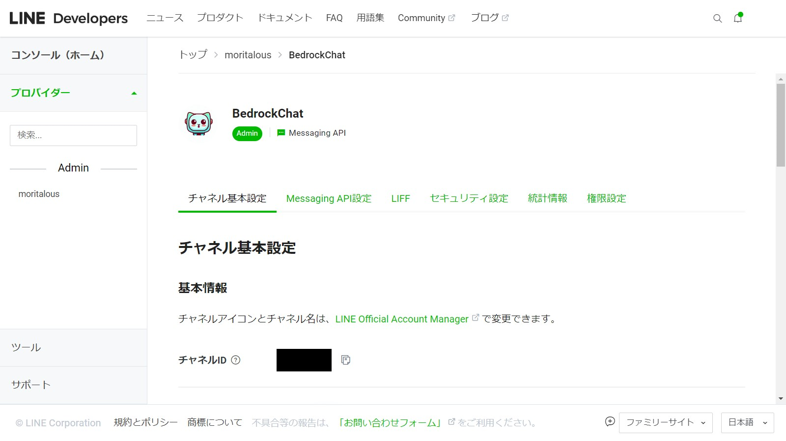
---
6. Messaging API設定タブに移動し、画面下部にあるチャネルアクセストークン（長期） の発行ボタンをクリックします。表示されるアクセストークンをメモします。
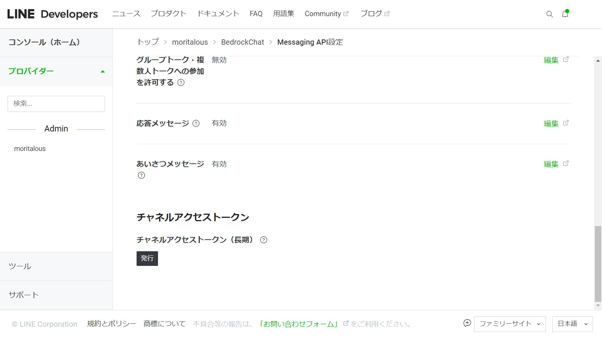

---
# LINE村のしきたり

1. 署名を検証せよ！
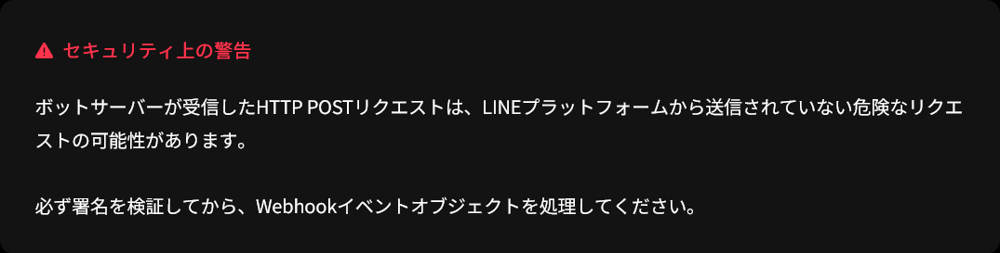

→SDKを使おう！

```shell
pip install line-bot-sdk
```

---
# LINE SDKを組み込んだ`app.py`

SDKのサンプルソースを参考にしました。

```python
import os

from linebot.v3 import (WebhookHandler)
from linebot.v3.exceptions import (InvalidSignatureError)
from linebot.v3.messaging import (
    Configuration,
    ApiClient,
    MessagingApi,
    ReplyMessageRequest,
    TextMessage
)
from linebot.v3.webhooks import (MessageEvent,TextMessageContent)

LINE_CHANNEL_ACCESS_TOKEN = os.getenv('LINE_CHANNEL_ACCESS_TOKEN')
LINE_CHANNEL_SECRET = os.getenv('LINE_CHANNEL_SECRET')
```

---

```python
line_configuration = Configuration(access_token=LINE_CHANNEL_ACCESS_TOKEN)
line_handler = WebhookHandler(channel_secret=LINE_CHANNEL_SECRET)

@line_handler.add(MessageEvent, message=TextMessageContent)
def handle_message(event: MessageEvent):

    user_id = event.source.user_id  # ユーザーID
    text = event.message.text       # ユーザーのメッセージ

    with ApiClient(line_configuration) as api_client:

        line_bot_api = MessagingApi(api_client)
        line_bot_api.reply_message_with_http_info(
                ReplyMessageRequest(
                    reply_token=event.reply_token,
                    messages=[TextMessage(text='応答文言')]
                )
            )
```

---

```python
# Lambdaのエントリーポイント
def lambda_handler(event, context):

    # get X-Line-Signature header value
    signature = event['headers']['x-line-signature']

    # get request body as text
    body = event['body']

    line_handler.handle(body,signature)

    return {
        'statusCode': 200, 
        'body': 'OK'
        }
```

---
# Bedrock部分を追加 (Let's bedrocking)

```diff
+ from bedrock import conversation

  <<略>>

  @line_handler.add(MessageEvent, message=TextMessageContent)
  def handle_message(event: MessageEvent):
      user_id = event.source.user_id  # ユーザーID
      text = event.message.text       # ユーザーのメッセージ
  
      with ApiClient(line_configuration) as api_client:
+         response = conversation(input=text, session_id=user_id)
          line_bot_api = MessagingApi(api_client)
          line_bot_api.reply_message_with_http_info(
                  ReplyMessageRequest(
                      reply_token=event.reply_token,
-                     messages=[TextMessage(text='応答文言')]
+                     messages=[TextMessage(text=response)]
                  )
              )
```

---
# 完成

LINEでチャットができました。

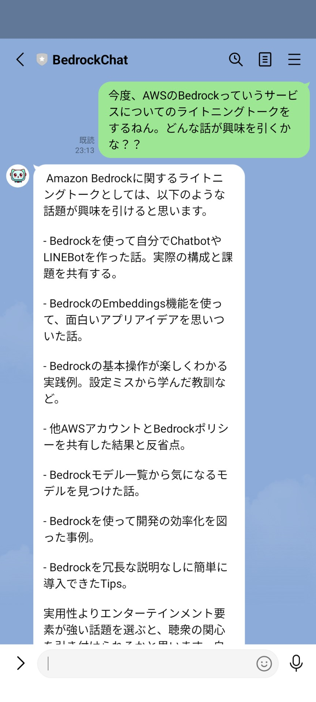

---
<!-- _class: lead -->
<!-- _paginate: skip -->
<!-- _color: WHITE -->
<!-- _backgroundColor: #232f3e -->

# <!-- fit -->2. SlackとBedrock(Stable Diffusion XL)で画像生成

---
<!-- _class: lead -->
いきなりですが
# <!--fit-->Bedrockする

I'm just a Japanese BEDROCKER!

---
# Stable Diffusion XLで画像生成

※）Stable Diffusion XLはまだ東京リージョンでは使えません

* ライブラリーをインストール

```
pip install boto3 pillow
```

* テキストから画像生成

```python
from PIL import Image
import base64
import boto3
import io
import json

client = boto3.client('bedrock-runtime')
```

---
```python
body = {
  'text_prompts':  [{'text': 'land of the deer and the great Buddha'}],
}

response = client.invoke_model(
  modelId='stability.stable-diffusion-xl-v0',
  body=json.dumps(body)
)

response_body = json.loads(response.get('body').read())

base64_str = response_body['artifacts'][0].get('base64') # Base64でエンコードされた画像
image_byte = base64.decodebytes(bytes(base64_str, 'utf-8')) # デコード
image = Image.open(io.BytesIO(image_byte))　# Imageに変換して
image.save('sdxl.png') # 保存
```

---


---
# 画像+プロンプトもできる

```python
# 画像を読み込んでBase64エンコードする
init_image = Image.open('sdxl.png')
buffer = io.BytesIO()
init_image.save(buffer, format='png')
init_image_bytes = buffer.getvalue()
init_image_base64 = base64.b64encode(init_image_bytes).decode('utf-8')

# init_imageを指定する
body = {
  'text_prompts':  [{'text': 'watercolor'}],  # 水彩画風
  'init_image': init_image_base64
}

response = client.invoke_model(
  modelId='stability.stable-diffusion-xl-v0',
  body=json.dumps(body)
)
```

---


---
<!-- _class: lead -->
# <!--fit-->さて、そろそろSlack

---
# Bolt for Python

SlackもSDKがあります。

Bolt 入門ガイドがとてもわかり易いので、まずはこちらを実施しましょう。

* ソケットモードを使ったガイド
https://slack.dev/bolt-python/ja-jp/tutorial/getting-started

* Webhookを受ける形式のガイド
https://slack.dev/bolt-python/ja-jp/tutorial/getting-started-http

---
# Slack村のしきたり

1. リクエストから3秒以内にHTTPレスポンスを返却する必要がある
時間のかかる処理は別スレッド（や別プロセス）で行うようにし、急いでレスポンスを返さないといけない

ただし、Lambdaの場合、HTTPレスポンスを返すと別スレッド（や別プロセス）を実行し続けてくれない

---
# SDKがLambda対応

内部的に自分自身を非同期呼び出しする仕組みが組み込まれています。（すごい）

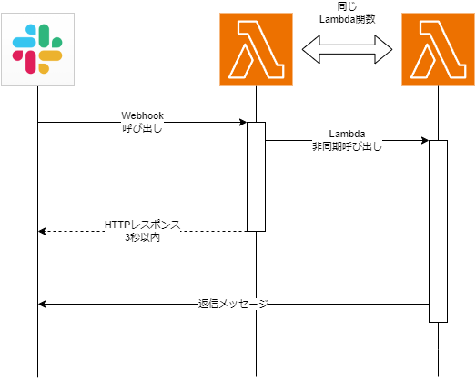

---
# Lambdaレイヤーを作成

1. requirements.txtを作成

    ```
    boto3
    pillow
    requests
    slack_bolt
    ```

2. ZIPを作成

    ```shell
    pip install -r requirements.txt -t python
    zip -r slack-bedrock-layer.zip python
    ```

3. マネジメントコンソールでLambdaレイヤーを登録

---
# Lambdaを作成

1. Lambdaレイヤーを追加
2. IAMロールに`自分自身のLambdaをInvokeする権限`と、`Bedrockを呼び出す権限`を追加
3. タイムアウトを1分に延長

* Lambdaプログラム

```python
import logging

from slack_bolt import Ack, App, Say
from slack_bolt.adapter.aws_lambda import SlackRequestHandler

app = App(process_before_response=True, logger=logging.Logger(name='app'))

```

---

```python
def respond_to_slack_within_3_seconds(body: dict, ack: Ack):
    ack("Accepted!")

import time
def run_long_process(message: dict, say: Say):
    time.sleep(5)  # 3 秒より長い時間を指定します
    say('Hello')

app.message("hello")(ack=respond_to_slack_within_3_seconds, lazy=[run_long_process])

def lambda_handler(event, context):
    
    slack_handler = SlackRequestHandler(app=app)
    return slack_handler.handle(event, context)
```


---
# Slackアプリを作成して設定

入門ガイドの通り実行します。

1. アプリを新規作成
2. `OAuth & Permissions`の`Bot Token Scopes`でスコープを追加
   * `chat:write`、`files:read`、`files:write`
3. ワークスペースにアプリをインストール
4. Bot User OAuth Token（xoxb-）を取得
5. `Basic Information`の`App Credentials`にあるSigning Secretを取得
6. Lambdaの環境変数をセット
   * `SLACK_BOT_TOKEN` に `Bot User OAuth Token` 
   * `SLACK_SIGNING_SECRET` に `Signing Secret`

---
7. `Event Subscriptions`の`Enable Events`をオンにし、`Request URL`にLambdaの関数URLをセット
8. `Event Subscriptions`の`Subscribe to bot events`にイベントを追加
   * `message.channels`、`message.groups`、`message.im`、`message.mpim`
9. `Save Changes`ボタンをクリック
10. 権限が追加されたので、アプリを再度インストール
11.  App Homeの`Allow users to send Slash commands and messages from the messages tab`にチェック

手順11. を行わないと、チャットでメッセージが投げられないと思います。

---
# 画像をBedrockするLambda (Let's bedrocking)

```python
import base64
import json
import logging
import os

from slack_bolt import Ack, App, Say
from slack_bolt.adapter.aws_lambda import SlackRequestHandler
from slack_sdk.web import WebClient

import boto3
import requests

bedrock = boto3.client('bedrock-runtime') # Bedrockアクセス用のクライアントを生成

app = App(process_before_response=True, logger=logging.Logger(name='app'))
```
---
```python
# Ackを返す関数
def respond_to_slack_within_3_seconds(body: dict, ack: Ack):
    ack("Accepted!")

# 非同期Lambdaで実行される処理本体
def run_long_process(message: dict, say: Say, client: WebClient):

    channel_id = message['channel']

    SLACK_BOT_TOKEN=os.environ.get("SLACK_BOT_TOKEN")

    for file in message['files']:
        url_private = file['url_private']
        mimetype = file['mimetype']
        filetype = file['filetype']

        if filetype in ['jpg', 'png']:
            # HTTPヘッダーに認証情報をつけて添付ファイルを取得
            headers={'Authorization': f'Bearer {SLACK_BOT_TOKEN}'}
            image = requests.get(url=url_private, headers=headers)
```
---
```python
            # 取得した添付ファイルをBase64でエンコード            
            init_image  = image.content
            init_image = base64.b64encode(init_image).decode('utf-8')

            ##################
            # Bedrocking!!!! #
            ##################
            body = json.dumps({
                'text_prompts': [{'text': 'watercolor'}],
                'init_image': init_image,
            })
            
            bedrock_response = bedrock.invoke_model(
                modelId='stability.stable-diffusion-xl-v0',
                body=body)
                
            response_body = json.loads(bedrock_response.get('body').read())
            # Base64エンコードされた画像が取得できる
            response_body_base64 = response_body['artifacts'][0].get('base64')
            # Base64をデコード
            response_image = base64.decodebytes(bytes(response_body_base64, 'utf-8'))
```
---
```python
            # Bedrockした画像をアップロードしてチャットに返答
            client.files_upload_v2(
                channel=channel_id,
                file=response_image,
                title='Generated by Stable Diffusion (Bedrock Edition)',
            )

# 添付ファイル付きメッセージの場合のイベント処理
app.event({'type': 'message', 'subtype': 'file_share'})(ack=respond_to_slack_within_3_seconds, lazy=[run_long_process])

# Lambdaハンドラー
def lambda_handler(event, context):
    
    slack_handler = SlackRequestHandler(app=app)
    return slack_handler.handle(event, context)
```

（エラー処理とか、添付ファイルが無いときとか、その他諸々はお願いします。）

---
# 完成

Slackでチャットができました。


スマホのカメラで撮影した画像を使うと解像度が高すぎるかも。

512 x 512程度に抑えるほうが良さそうなので、画像をリサイズする工夫も検討しましょう。

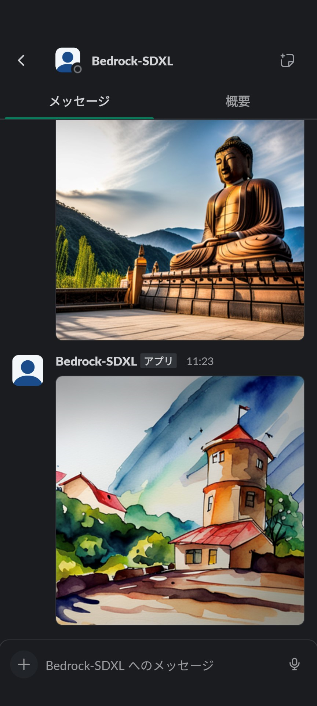

---
# まとめ

* とりあえず入村！

* Bedrockでチャットも画像生成も簡単
  * IAMとかboto3とか、AWSサービスを使ってる感覚で生成系AIを使えるのが、Bedrockの最大のメリット（個人の主観です）

* LINEもSlackもSDKがあるし、Lambdaで動く
  
* LangChainが対応しているので、OpenAIでできることはBedrockでもできる
（と、思わせてくれる。ホントのところはわからないけど）

* JAWSで登壇できてとても嬉しいです。みんなもBedrockしてJAWSに参加しよう！

---
# お土産

GitHubにソースを公開しています。

* bedrock-line-chat
https://github.com/moritalous/bedrock-line-chat

* bedrock-slack-sdxl
https://github.com/moritalous/bedrock-slack-sdxl

Qiitaの記事もよかったらどうぞ。

* 祝GA！！Amazon BedrockとチャットができるLINEボットをオープンソースで公開しました - Serverless Application Repositoryから簡単インストール可
https://qiita.com/moritalous/items/6e0864d724d04d4ecf22


<!--
---
# 参考サイト

https://draculatheme.com/marp
https://zenn.dev/cota_hu/books/marp-beginner-advanced/viewer/create-3
https://www.youtube.com/watch?v=EzQ-p41wNEE

-->